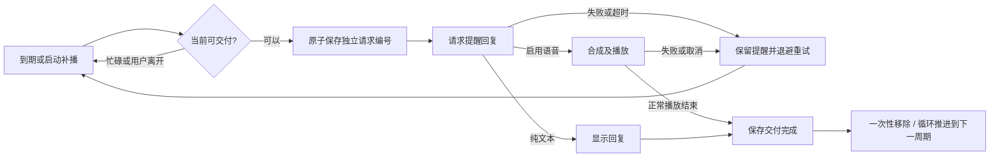

# 可靠性修复（2026-10-01）

## 本轮范围

落实第一批四项：记忆/日程原子存储、记忆稳定 ID 与角色隔离、提醒交付及重试、OAuth 请求隔离。亚托莉仍是默认维护角色；启动入口沿用启动.bat。

ZIP 异步处理、其他设置页网络交互、拖动取消、Dialog 拆分、渲染及摄像头性能属于后续阶段。

## 1. 原子存储

新增 AtomicJsonStore，统一用 QSaveFile 临时文件提交，关闭直接写原文件的回退。目录创建、打开、读取、写入和提交失败均返回错误；无效 JSON 或不符合记忆/日程结构的数据会保留原文件。

Dialog 的记忆缓存、提醒列表以及设置页的成功提示在提交成功后更新。添加、取消、清空提醒都先生成候选列表，落盘成功后再替换当前列表。提醒完成状态若暂时无法写入，会保留完成结果继续尝试提交，不再次播报。

现有 JSON 配置键保持兼容。配置中的 API Key、模型选择等仍通过原来的 ZcJsonLib 读写；本轮存储改动针对 memory.json 与 schedules.json。

## 2. 记忆稳定身份

新增 MemoryStore：

- 老摘要没有 ID、或存在重复 ID 时，生成 UUID 并原子保存；已有唯一 ID 保留。
- 按条目 ID 删除，列表顺序变化不会导致误删；个人信息及其他根字段保留。
- 删除/清空绑定显示时的角色文件路径，与当前角色不一致就拒绝。角色切换信号会刷新页面。
- 记忆提取回调绑定路径及 generation；角色切换、设置页删除或清空后，旧提取回调失效。
- 提取结果重新读取最新文件再合并，避免使用旧缓存重新带回已删除的条目；提交成功才更新缓存。
- 新摘要继续去重并保留最近 20 条，每条具有独立 ID。

## 3. 提醒交付与重试

新增 ReliableReminder 状态类型及 ReminderDeliveryGate，接入 Dialog 的提醒、主动回复和语音管线。

具体规则：

- 日程独立于主动闲聊开关和冷却；用户忙碌、离开、录音或连续对话时保留等待。
- 正常到期与启动补播共用一个队列，每次处理一条。超过 24 小时的提醒也保留，不再自动删除。
- 请求发出前保存 attempt ID，正在交付的提醒不重复发起；旧编号的完成/失败回调不能改变新尝试。
- 未启用语音或回复没有日语段时，显示中文回复后提交完成；启用语音时等待 EndOfMedia。单纯 StoppedState 不算成功。
- AI 回复为空、请求失败、语音合成/播放失败、取消或超时都保留提醒，退避为 5、10、20、40、80、160、300 秒，此后最多每 300 秒重试。
- AI 请求超时 45 秒，整个交付尝试超时 120 秒；取消时收回对应 provider 和语音管线。
- 循环提醒成功交付后才推进时间，使用算术跳转跨过过期周期，不再逐周期 while 循环。
- 重启会撤销旧进程的请求认领，未完成提醒重新进入队列。

交付定义是“文本已显示”或“播放器正常结束”，不等于确认用户实际看见或听见。该恢复策略保证未完成任务保留；若崩溃恰好发生在播放结束、完成状态落盘之前，重启后可能重复一次。当前去重针对单一应用进程，不提供跨多个桌宠实例的分布式认领。

## 4. OAuth 请求隔离

SearchProvider 可注入网络管理器供测试使用；默认仍创建自己的 QNetworkAccessManager，注入实例需比提供者存活更久。

- token 请求有当前 reply 与配置 generation，回调同时验证所属请求。
- 获取 token 期间，多次搜索合并为最新查询，不重复认证。
- API Key、Secret Key、地址或启用状态真正变化才使请求/缓存失效；配置重载中的同值设置不清空 token。
- 失效先撤销认领、断开提供者回调再 abort，避免同步 finished 重入；配置取消会通知调用方释放忙碌状态。
- 旧 token 的成功/失败和旧搜索结果均不能污染新请求。
- token 提前过期余量按有效期调整，短期 token 不再减去整整一天。
- OAuth 密钥通过表单正文发送，不放在 URL 查询参数；千帆分支按 URL 的真实 host 判断。

## 验证

新增 test_reliability，扩展 test_searchprovider：

- Windows 文件占用导致原子提交失败：旧文件及输出缓存保留。
- 损坏 JSON、错误记忆摘要类型和错误日程结构不覆盖已有数据。
- 老记忆 ID 迁移可重复读取，重排后删除正确条目，跨角色相同 ID 的操作被拒绝。
- 提取合并最新文件，不带回已删除条目，并保持摘要去重。
- 提醒失败重试、旧编号拒绝、重启恢复、循环推进及播放交付门控。
- 本地 HTTP 请求替换与销毁；受控网络模拟 OAuth 合并、短期缓存、配置变化、旧响应晚到及禁用取消。

专项日志：build2/reliability-2026-10-01.log（11 passed，0 failed），build2/oauth-2026-10-01.log（7 passed，0 failed），均包含初始化与清理。

Release 主程序与新增/扩展测试构建成功；`ctest --test-dir build2 -C Release --output-on-failure` 完整回归 **12/12 通过，397.58 秒**。真实 config.ini 的 SHA256 测试前后一致（11E75B844D28726C85B7C28BB23653254C06955D7303AF1AA3227C195E3ADD75），`git diff --check` 无空白错误。

没有启动桌宠，没有调用真实 LLM、语音合成、录音或摄像头。Dialog 的真实播放器与日程端到端行为尚未实机验证；状态与持久化合同已由测试覆盖，信号接入已通过编译和代码核对。未创建发布包。

## 提交边界

按原子存储、记忆身份、提醒交付、OAuth 分成四个提交；每个领域包含对应测试；test_memorystore 与 test_reliability 分开，提醒代码直接包含 AtomicJsonStore，回退记忆领域不会移除提醒的依赖。原子存储作为公共基础，记忆与提醒依赖它；回退基础提交时需要同时处理依赖。为单独验证公共基础，补充 test_atomicjsonstore。此前的换装、Live2D、线程生命周期等改动保留在工作区，不纳入这四个提交。
